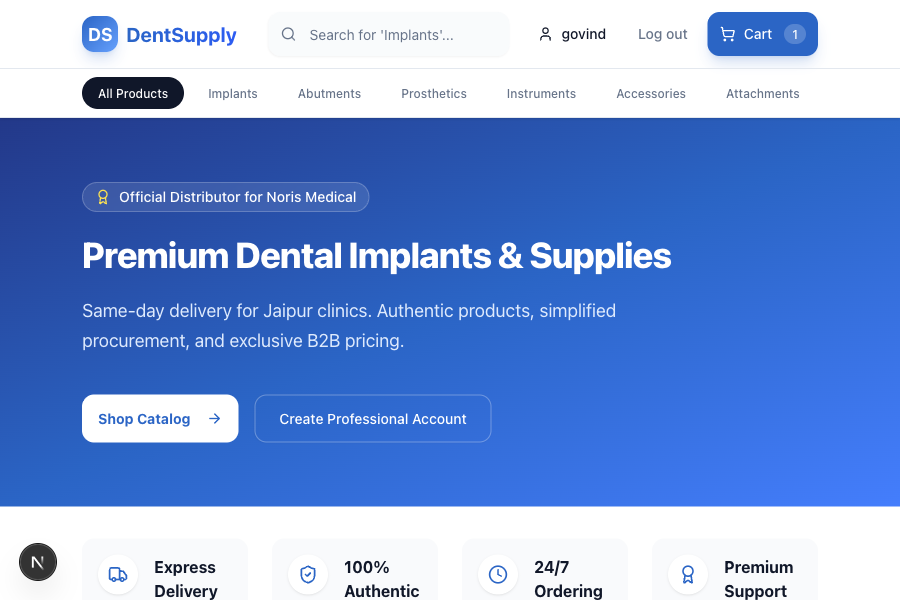
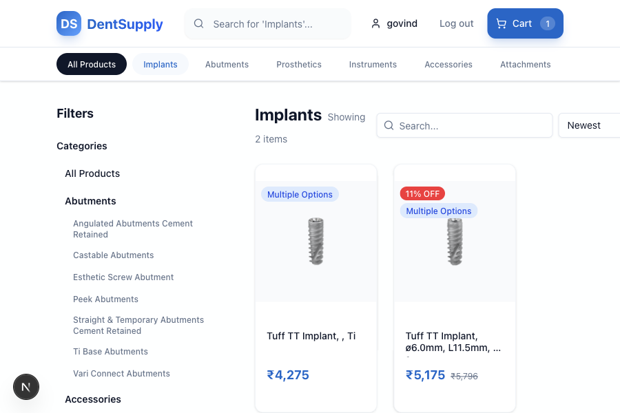
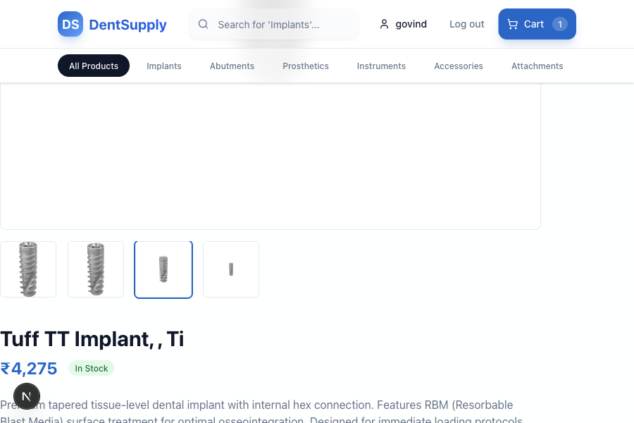
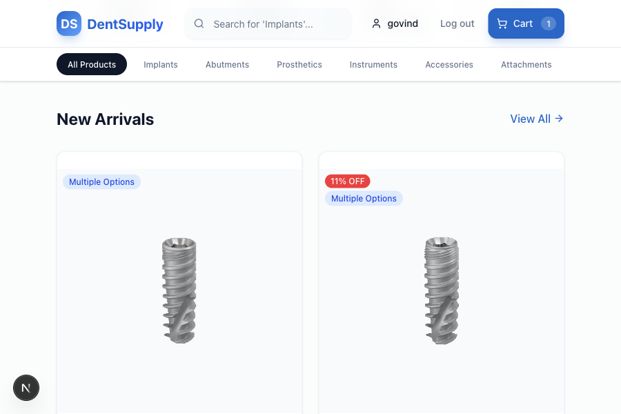

# 🏥 DentSupply: Premium B2B Dental E-Commerce

[](https://nextjs.org/)
[](https://fastapi.tiangolo.com/)
[](https://tailwindcss.com/)
[](https://www.framer.com/motion/)

A state-of-the-art B2B Quick Commerce PWA designed for dental clinics and laboratories. DentSupply offers a human-centric, high-performance shopping experience for professional dental implants and supplies.

---

## ✨ Experience the Magic

### 🎥 Website Tour
See the platform in action with our smooth animations and modern interface.


---

## 📸 Visual Showcase

````carousel

<!-- slide -->

<!-- slide -->

<!-- slide -->

````

---

## 🚀 Key Features

- **⚡️ Blazing Fast Performance**: Built with Next.js 15 for optimal speed and SEO.
- **🎨 Museum-Grade UI/UX**: Modern, clean design with smooth micro-animations using Framer Motion.
- **📱 PWA Ready**: Optimized for mobile with a native-app feel.
- **📦 Advanced Catalog**: Detailed product management with categorization and slug-based navigation.
- **🔐 Secure Authentication**: Robust user authentication and role-based access control.
- **💳 Integrated Payments**: Seamless checkout flow with Razorpay integration.
- **📊 Admin Dashboard**: Comprehensive management of orders, products, and users.

---

## 🛠 Tech Stack

### Frontend
- **Framework**: Next.js 15 (App Router)
- **Styling**: Tailwind CSS + Shadcn UI
- **Animations**: Framer Motion
- **State Management**: React Context API
- **API Client**: Axios

### Backend
- **Framework**: FastAPI (Python)
- **Database**: PostgreSQL (via SQLAlchemy)
- **Migration**: Alembic
- **Security**: JWT Authentication + Passlib (Bcrypt)

---

## 🏁 Getting Started

### 1. Prerequisites
- Node.js 18+
- Python 3.11+
- PostgreSQL (or SQLite for development)

### 2. Setup

**Backend:**
```bash
cd backend
python -m venv venv
source venv/bin/activate
pip install -r requirements.txt
cp .env.example .env
# Update .env with your configuration
uvicorn app.main:app --reload
```

**Frontend:**
```bash
cd frontend
npm install
cp .env.example .env.local
# Update .env.local with your backend URL
npm run dev
```

---

## 🛡 Security & Best Practices

This project follows strict security guidelines:
- **Environment Isolation**: No sensitive credentials in version control.
- **Secure Configuration**: Config managed via Pydantic Settings.
- **Cleanup**: Committed environment files have been removed and `.gitignore` updated.

---

## 📄 License

Professional Usage only for DentSupply. All rights reserved.

---

*Built with ❤️ for the Dental Industry.*
